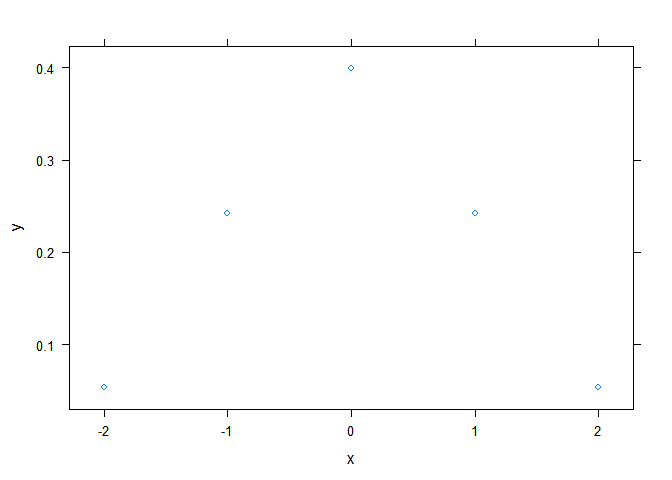

<!-- README.md is generated from README.Rmd. Please edit that file -->
tags
====

This package consists of a collection of tags built using the functions and principle designed and described in the package *tag*. See the read me at : <https://github.com/moodymudskipper/tag>.

It allows things like the following :

``` r
library(tags)
df_name <- "iris"
# use quasi quotation with any function
using_bang$head(!!rlang::sym(df_name),1)
#>   Sepal.Length Sepal.Width Petal.Length Petal.Width Species
#> 1          5.1         3.5          1.4         0.2  setosa
# use purrr adverbs with tag syntax
using_possibly$log("a", .otherwise = NA_real_)
#> [1] NA
# use withr functions with tag syntax
setting_options(list(scipen = 100))$print(exp(100))
#> Loading required namespace: withr
#> [1] 26881171418161356094440640202808862000420226
```

Installation and setup :

``` r
# devtools::install_github("moodymudskipper/tag")
# devtools::install_github("moodymudskipper/tags")
library(tags)
suppressPackageStartupMessages(library(tidyverse,warn.conflicts = FALSE))
```

The package contains over 50 tags that can be divided into the following categories.

-   tag counterparts to `base` and `purrr` adverbs :
    -   `vectorizing` (wraps `base::Vectorize`)
    -   `negating` (wraps `base::Negate`)
    -   `using_safely` (borrows code from `purrr::safely`)
    -   `using_quietly` (borrows code from `purrr::quietly`)
    -   `using_possibly` (borrows code from `purrr::possibly`)
-   tag counterparts to `withr` functions :
    -   all 31 `withr::with_*` functions have `tags::setting_*` counterparts
-   tag expanding *tidyverse* features :
    -   `using_bang` to make any function compatible with quasi-quotation
    -   `using_lambda` to use formula notation in any functional
    -   `grouping_by` to use `dplyr::group_by` on a single operation
    -   `using_rowwise` to use `dplyr::rowwise` on a single operation
    -   `selecting_dots`, `renaming_dots`, `mutating_dots`, `transmuting_dots`, `reversing_dots` to edit the dots passed to a call before it's executed, using `dplyr` semantics.
-   tags focused on side effects
    -   `viewing` (wraps `utils::View`)
    -   `debugging` (wraps `base::debugonce`)
    -   `logging` to print call and execution time (wraps `Sys.time()`)
    -   `progressing` to add a progress bar to any functional (wraps `progress::progress_bar`)
    -   `beeping` to play a sound once the call is over (wraps `beepr::beep`)
    -   `popping_up` to trigger a message box once the call is over (wraps `tcltk::tk_messageBox`)
-   other tags
    -   `composing` as an alternative to piping/functional sequences (wraps *magrittr*'s functional sequences)
    -   `using` as the tag counterpart to `with`, with extra features
    -   `mapping` to loop over argument values (wraps `foreach::foreach`)
    -   `self_referencing` to avoid variable repetition with functions such as `base::transform` / `dplyr::mutate`, `dplyr::summarize`
    -   `tracing` as a tag counterpart to `base::trace`
    -   `enclosing` to enclose the input function in another function.
    -   `preserving_attr` to make sure some attributes are preserved
    -   `suppressing_warnings` to selectively suppress warnings based on a regular expression.
    -   `checking_args` to operate checks on arguments before calling the function

### tag counterparts to `base` and `purrr` adverbs :

#### *base* adverbs

``` r
vectorizing$rep.int(times = 1:3, x = 3:1)
#> [[1]]
#> [1] 3
#> 
#> [[2]]
#> [1] 2 2
#> 
#> [[3]]
#> [1] 1 1 1
vectorizing("times")$rep.int(times = 1:3, x = 42)
#> [[1]]
#> [1] 42
#> 
#> [[2]]
#> [1] 42 42
#> 
#> [[3]]
#> [1] 42 42 42
negating$is.character("foo")
#> [1] FALSE
```

#### *purrr* adverbs

``` r
using_possibly(.otherwise = NA)$log("a")
#> [1] NA
using_safely$log("a")
#> $result
#> NULL
#> 
#> $error
#> <simpleError in .Primitive("log")(x = "a"): non-numeric argument to mathematical function>
using_safely(.otherwise = NA)$log("a")
#> $result
#> [1] NA
#> 
#> $error
#> <simpleError in .Primitive("log")(x = "a"): non-numeric argument to mathematical function>
using_quietly$sqrt(-1)
#> $result
#> [1] NaN
#> 
#> $output
#> [1] ""
#> 
#> $warnings
#> [1] "NaNs produced"
#> 
#> $messages
#> character(0)
```

### tag counterparts to `withr` functions

``` r
setting_options(c(scipen = "999"))$print(exp(100))
#> [1] 26881171418161356094440640202808862000420226
fun <- function(x, y){ xyplot(y ~ x, data.frame(x = x, y = y))}
setting_package("lattice")$fun(x = -2:2, y = dnorm(-2:2))
```



``` r
c(setting_seed(1)$sample(1e4,1), sample(1e4,1), 
  setting_seed(1)$sample(1e4,1), sample(1e4,1))
#> [1] 1017 7275 1017 9309
```

See also `setting_bmp`, `setting_cairo_pdf`, `setting_cairo_ps`, `setting_collate`, `setting_connection`, `setting_db_connection`, `setting_dir`, `setting_environment`, `setting_envvar`, `setting_file`, `setting_jpeg`, `setting_libpaths`, `setting_locale`, `setting_makevars`, `setting_message_sink`, `setting_namespace`, `setting_output_sink`, `setting_par`, `setting_path`, `setting_pdf`, `setting_png`, `setting_postscript`, `setting_preserve_seed`, `setting_svg`, `setting_temp_libpaths`, `setting_tempfile`, `setting_tiff`, `setting_xfig`

### tag expanding *tidyverse* features

#### quasi quotation and lambda functions

``` r
df_name <- "iris"
using_bang$head(!!rlang::sym(df_name),2)
#>   Sepal.Length Sepal.Width Petal.Length Petal.Width Species
#> 1          5.1         3.5          1.4         0.2  setosa
#> 2          4.9         3.0          1.4         0.2  setosa
using_lambda$ave(1:6,rep(1:2,each = 3), FUN = ~median(.)*10)
#> [1] 20 20 20 50 50 50
```

#### grouping

group or apply `rowwise` for a single operation.

``` r
library(dplyr,warn.conflicts = FALSE, quiet = TRUE)
iris %>%
  grouping_by("Species")$summarize(meanSL = mean(Sepal.Length))
#> # A tibble: 3 x 2
#>   Species    meanSL
#>   <fct>       <dbl>
#> 1 setosa       5.01
#> 2 versicolor   5.94
#> 3 virginica    6.59
head(starwars) %>%
    using_rowwise$transmute(film1 = films[1])
#> # A tibble: 6 x 1
#>   film1               
#>   <chr>               
#> 1 Revenge of the Sith 
#> 2 Attack of the Clones
#> 3 Attack of the Clones
#> 4 Revenge of the Sith 
#> 5 Revenge of the Sith 
#> 6 Attack of the Clones
```

### dot operations

We can edit the dots wether we feed them to the manufactured function directly or pass them through another.

``` r
library(rlang, ,warn.conflicts = FALSE)
fun <- function(...){
  lst(
    selecting_dots(vars(starts_with("b")))$paste(...),
    renaming_dots(exprs(quz = bar))$tibble(...),
    mutating_dots(exprs(foo = paste0(toupper(foo), bar)))$tibble(...),
    transmuting_dots(exprs(foo = paste0(toupper(foo), bar)))$tibble(...)
    )
}
fun(foo = "a", bar = "b", baz = "c")
#> $`selecting_dots(vars(starts_with("b")))$paste(...)`
#> [1] "b c"
#> 
#> $`renaming_dots(exprs(quz = bar))$tibble(...)`
#> # A tibble: 1 x 3
#>   foo   quz   baz  
#>   <chr> <chr> <chr>
#> 1 a     b     c    
#> 
#> $`mutating_dots(exprs(foo = paste0(toupper(foo), bar)))$tibble(...)`
#> # A tibble: 1 x 3
#>   foo   bar   baz  
#>   <chr> <chr> <chr>
#> 1 Ab    b     c    
#> 
#> $`transmuting_dots(exprs(foo = paste0(toupper(foo), bar)))$tibble(...)`
#> # A tibble: 1 x 1
#>   foo  
#>   <chr>
#> 1 Ab

reversing_dots$paste("a","b")
#> [1] "b a"
```

### tags focused on side effects

`logging` to print and time a call

``` r
x <- logging$Sys.sleep(2)
#> logging$Sys.sleep(2)
#>   ~ 2.04 sec
#> NULL
x <- logging(.time = FALSE, .print = FALSE)$Sys.sleep(2)
#> logging(.time = FALSE, .print = FALSE)$Sys.sleep(2)
```

`suppressing_warnings` to selectively suppress warnings based on a regular expression.

``` r
fun <- function(x) {
  warning("ooops", call. = FALSE)
  sqrt(x)
}
fun(-1)
#> Warning: ooops
#> Warning in sqrt(x): NaNs produced
#> [1] NaN
suppressing_warnings$fun(-1)
#> [1] NaN
suppressing_warnings("prod")$fun(-1)
#> Warning: ooops
#> [1] NaN
suppressing_warnings(~startsWith(., "o"))$fun(-1)  
#> Warning in sqrt(x): NaNs produced
#> [1] NaN
```

``` r
# open the output in the viewer
viewing$head(iris,2) 
# run debugonce on input function
debugging$mean(1:5)  
# add a progress bar to a functional using `progress::progress_bar`
progressing$sapply(1:4, ~Sys.sleep(1))
# beep after the call finishes using `beepr::beep`
beeping$Sys.sleep(1)
# message after the call finishes using `tcltk::tk_messageBox`
popping_up("done!")$Sys.sleep(1)
```

### other tags

`composing` as an alternative to piping/functional sequences (wraps *magrittr*'s functional sequences)

``` r
f <- composing$head$dim()
f(iris)
#> [1] 6 5
composing$head(1)$rename_all(toupper)(iris)
#>   SEPAL.LENGTH SEPAL.WIDTH PETAL.LENGTH PETAL.WIDTH SPECIES
#> 1          5.1         3.5          1.4         0.2  setosa
```

`using` as the tag counterpart to `with`, with extra features using methods `[.tag_using` and `[[.tag_using`

``` r
using(iris)$tapply(Sepal.Length, Species, FUN = mean)
#>     setosa versicolor  virginica 
#>      5.006      5.936      6.588
vec <- c(a = 1, b = 3, c = 2, d = 4)
using(vec)[. < b]
#> a c 
#> 1 2
using(vec)[[d * length(.)]]
#> [1] 16
```

`mapping` to loop over argument values (wraps `foreach::foreach`)

``` r
mapping(list(times=1:3,x=4:6))$rep()
#> Loading required namespace: foreach
#> [[1]]
#> [1] 4
#> 
#> [[2]]
#> [1] 5 5
#> 
#> [[3]]
#> [1] 6 6 6
mapping(list(times=1:3))$rep(4:6)
#> [[1]]
#> [1] 4 5 6
#> 
#> [[2]]
#> [1] 4 5 6 4 5 6
#> 
#> [[3]]
#> [1] 4 5 6 4 5 6 4 5 6
```

`self_referencing` to avoid variable repetition

``` r
head(iris,2) %>%
  self_referencing$transmute(
    Sepal.Area = Sepal.Length * Sepal.Width,
    Petal.Length = ~.*100,
    Species = ~toupper(.))
#>   Sepal.Area Petal.Length Species
#> 1      17.85          140  SETOSA
#> 2      14.70          140  SETOSA
```

`tracing` as a tag counterpart to `base::trace`

``` r
h <- tracing(quote(message("Show first rows")), .exit = quote(print("exiting!")))$head
h(iris,2)
#> Show first rows
#> [1] "exiting!"
#>   Sepal.Length Sepal.Width Petal.Length Petal.Width Species
#> 1          5.1         3.5          1.4         0.2  setosa
#> 2          4.9         3.0          1.4         0.2  setosa
```

`wrapping` to wrap a call

``` r
wrapping(
  .before = print("hello"),
  .after = print(paste("result was:", .)),
  .around = suppressWarnings)$sqrt(-1)
#> [1] "hello"
#> [1] "result was: NaN"
#> [1] NaN
```

`preserving_attr` to make sure some attributes are preserved

``` r
x <- "foo"
attr(x,"my_attribute") <- "bar"
attr(paste0(x, "!"), "my_attribute")
#> NULL
attr(preserving_attr$paste0(x, "!"), "my_attribute")
#> [1] "bar"
```

`checking_args` to operate checks on arguments before calling the function

``` r
mean(1:5, na.rm = 1) # 1 is coerced to TRUE
#> [1] 3
checking_args(is.logical(na.rm))$mean(1:5, na.rm = 1)
#> Error in checking_args(is.logical(na.rm))$mean(1:5, na.rm = 1): is.logical(na.rm) is not TRUE
checking_args(is.logical(na.rm),"na.rm should be logical!")$mean(1:5, na.rm = 1)
#> Error in checking_args(is.logical(na.rm), "na.rm should be logical!")$mean(1:5, : na.rm should be logical!
```
